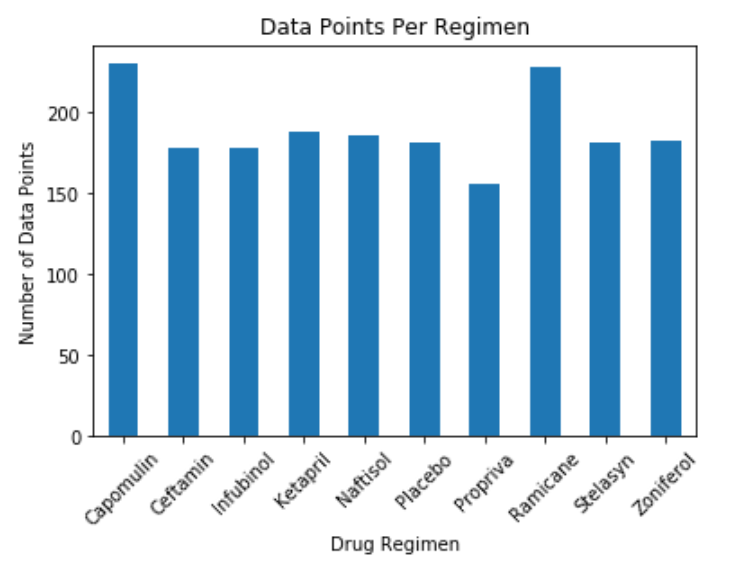
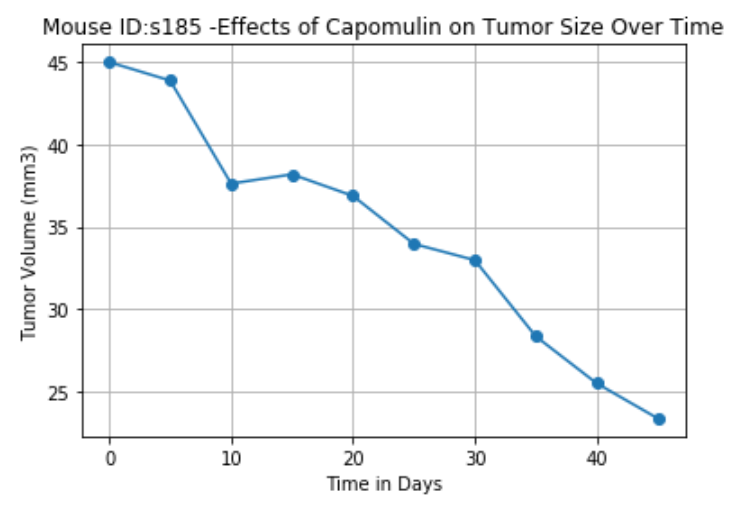

# Matplotlib 

Pymaceuticals Inc: Analysis of Pharmaceutical Capomulin
As the senior data analyst for Pymaceuticals Inc., a pharmaceutical company based in San Diego that specializes in anti-cancer treatments, I have been tasked to review data from a study of potential treatments for a commonly occurring skin cancer-  squamous cell carcinoma (SCC). 

The study compared the effects of several drug regimens on tumor growth on mice. Over the period of 45 days, 249 mice were treated with the different medications and their tumor growth was measured. 

Below you will see an analysis of the study as well as detailed results specifically from the drug treatment Capomulin. 

## Table of contents
* [Mouse Data](#mouse_data)
* [Mouse Gender](#mouse_gender)
* [Drug Regimens](#drug_regimens)
* [Capomulin Deep Dive](#capomilin_deep_dive)
* [Correlation](#correlation)
* [Conclusion](#conclusoin)
* [Jupyter Notebook](#jupyter_notebook)
* [Contact](#contact)

## Mouse Data

The study was conducted on 249 mice over the course of 45 days. The mice were evaluated every 5 days and their tumor growth was measured. 

To compile the data, I used a `pd.merge` function to combine to `csv` files into one combined `DataFrame`. I then used a `for loop` to locate any duplicate data logged per mouse ID. After locating duplicate data points, I used the `drop_duplicates` function to remove duplicate rows from the `DataFrame`. This left me with clean data for 249 mouse participants. 

Below is a table showing the `mean`, `median`, `variance`, `standard deviation` and standard error of the mean, or `SEM`, for the tumor volume (measured in mm3) for each drug regimens. 

To calculate this date, I used functions found in `sci.py.stats` and `numpy`. I was able to complete all calculations in one line of code by using an `.agg` function to apply the formulas to columns in a `DataFrame` . I went one step further to rename the column names for each equation to make the summary statsics easier to read. 

` grouped_regimen.agg({"Tumor Volume (mm3)": ['mean', 'median', 'var', 'std', 'sem']}).rename(columns={'mean' : 'Mean', 'median' : 'Median', 'var' : 'Variance', 'std' : 'Standard Deviation', 'sem' : "SEM"})`

## Mouse Gender

To calculate the gender breakdown the mice participants, I used a `.groupby` function on my clean moue data. I grouped the data by gender and mouse ID and added a `nunique( )` count to find the total number of unique mice per gender. 

I created a `pie plot` to show this date using two different methods- `Pandas` and `PyPlot`. They both created identical charts. I then formatted my `pie plot` by assigning colors and number formatting, plot labels and a title. 

`Pandas` method: ` mice_gender.plot(kind="pie", explode=explode, shadow=True, startangle=45, 
                 colors=colors, autopct="%1.1f%%", title="Mouse Gender")`

`PyPlot` method: ` plt.pie(mice_gender, explode=explode, shadow=True, startangle=45, 
                 colors=colors, autopct="%1.1f%%", labels=labels)`

## Drug Regimens

There were 9 Drug Regimens (and 1 placebo) used in this study. Each drug was given to a group of about 25 mice. The below charts show the number of timepoint data recorded per mice in each Drug Regimen. You will notice that the drugs Capomulin and Ramicane have the highest number of timepoint data recorded. This means that the mice give these drugs lived longer compared to mice using the other Drug Regimens. 

To calculate this, I used the `.groupby` function to group my data by ‘Drug Regimen’. Then I used a `.count( )` function to count the number of timepoints logged for each drug. 

I created `bar charts` to show this data. I used 2 methods to display the bar charts- `Pandas` and `PyPlot`. For the `Pandas` method, I used a `.count( )` function to count the number of timepoints logged for each drug. For the `PyPlot` method, I assigned a `len` formula to my x-axis ` x_axis = np.arange(len(timepoint_count))` 
They both created identical charts. I then formatted my `bar chart` by assigning labels to the x and y axis and a chart title. 

`Pandas` method: `mice_regimen = timepoint_count.plot(kind='bar')`

`PyPlot` method: ` x_axis = np.arange(len(timepoint_count))`  `plt.bar(x_axis, timepoint_count)`  `plt.xticks(x_axis, timepoint_count.index, rotation=45)`

I then evaluated the results of four specific Drug Regimens: Capomulin, Ramicane, Infubinol, and Ceftamin. I found the final timepoint logged for each mouse using these 4 drugs and created a list of the final tumor volume recorded. With these lists, I was able to plot them on a `Box Plot` to show the final tumor volumes and the potential outlier data per drug. 

To create this set of data, I used a `.grouby` function on my clean data to group the data by Mouse ID and Drug Regimen. I then calculated the last timepoint recorded for each mouse by using the `.max( )` formula on the Timepoint data. ` max_timepoint = mouse_id["Timepoint"].max()`

Then I used `pd.merge` to combine the clean mice data and my new `Max Timepoint` data. I merged the data on Mouse ID and Timepoint. 
` combined_timepoint_df = pd.merge(combined_mice_df, max_timepoint, on=["Mouse ID", "Timepoint"])` 

With the newly combined `DataFrame` that captures the last timepoint recorded of tumor volume, I created a list per drug regimen to hold these volumes. With each list, I calculated the `outlier` data by using the `upper` and `lower` bounds. I found that only the drug Infubinol had an `outlier` in the tumor volume data. 

With this data calculated for each of the four specific drug regimens, I then created a combined `box plot`. I did this by creating a `[list]` of my drug regimen `lists` to plot. I also formatted my `box plot` to show the outlier data as a red square - ` red_square = dict(markerfacecolor='r', marker='s')`

As you can see in the below Box Plot, Ramicane and Capomilin resulted in similar final tumor volume where Infubinol and Ceftamin had similar higher tumor volume. Infubinol is the only dataset with an outlier for tumor volume which can be seen below illustrated as a ‘red square’. 

## Capomulin Deep Dive
To further deep dive into the results of Capomulin specifically, I pulled out data of 1 mouse participant to show the progression of tumor volume over the 45-day case study.  

To find the date of one mouse who was given Capomulin as treatment, I did a `df.loc` search in my clean `DataFrame` to find the mice who were given Capomulin. Form that list, I selected a mouse who had timepoint data recorded until the end of the study. I then ploted those time points on the below line chart to show the correlation of tumor volume over time while using the drug Capomulin. 

This is the code I used to plot below : ` plt.plot(mouse_data["Timepoint"], mouse_data["Tumor Volume (mm3)"], marker="o")`  I also added `plt.grid( )` to make the chart easier to read. 

## Correlation
I also decided to look at the correlation of average tumor volume to mouse weight within the Capomulin data. To analysis this, I used the `.groupby` function to group my Capomulin data by Mouse ID and calculate the average date  by mouse with the `.mean( )` formula. 
` mouse_average = capomulin_data.groupby(["Mouse ID"]).mean()`
I then plotted these results on a `scatter plot` using `plt.scatter` 

With this data I then calculated the correlation of Mouse weight to Tumor Volume by using the `Pearsonr` formula. I also rounded the result to 2 decimal points to make it easier to read. 
` correlation = round(st.pearsonr(mouse_average['Weight (g)'], mouse_average['Tumor Volume (mm3)'])[0],2)` 

I then added a line to the `scatter plot` to help illustrate the line regress. I used the formula of a line to calculate this. ` line_eq = "y = " + str(round(slope,2)) + "x + " + str(round(intercept,2))`

I added the `line equation` to my `scatter plot` below by using `plt.annotate` and assigning a location to print the equation on the chart. I selected at the tick location of `(20,36)` . I also assigned the line to be ` color="red"` for easy viewing. 
` plt.annotate(line_eq,(20,36),fontsize=15,color="red")`

As you may have assumed, there is a positive correlation between mouse weigh and tumor volume. The heavier the moues, the larger the tumor volume is. 

## Conclusion
From the study conducted by Pymaceuticals Inc on mice to evaluate different drug regimens on tumor growth, I can conclude the following: 

1. Among the 9 drugs administered to the participating mice, the drugs Capomulin and Ramicane were the most effective in reducing tumor volume. 

2. When comparing mouse weight with tumor, there is a positive correlation showing that mice with a greater weight have larger tumor volumes. 

3. Over a 45-day period of time, a female mouse being given a drug regimen of Capomulin had a reduced tumor volume of about 21.66 mm3. 

## Jupyter Notebook
https://github.com/Ssimoes48/Matplotlib/blob/main/pymaceuticals_starter.ipynb

## Contact

Sara Simoes
